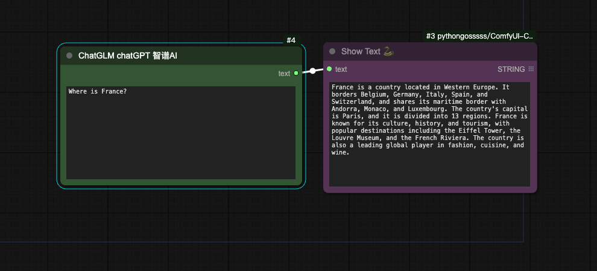

# comfyUI-tool-2lab

# 项目介绍 
增强comfyUI系统能力
- 上传工作流到服务器，自动部署为在线api。api对接到网页、微信小程序、Discord等平台（需服务端支持）
- 调用第三方api，如ChatGLM、GPT3.5、GPT4、百度翻译、有道翻译等

### 输入user Key
- 第一次使用时，需要在 input user key 节点中填入userKey的值。输入的userKey值会被保存，以后会自动读入。如果没有userKey，请到http://www.2lab.cn/pb/contactus 申请。
- 可以把example目录中的input_user_key.png拖入comfyUI网页，然后在节点中填写userKey，然后执行Queue Prompt

## 开发工作流
把输入参数设为2lab的Input Text, Input Int, Input Float, Input Seed, Input Image
把输入参数设为2lab的Output Image, Output Text, Output Video

## 发布工作流为在线api
添加一个publish to 2lab节点，填上你的工作流的id、名称name、描述desc。
测试时先把publish设为false，测试完成准备提交再设为true。
当publish设为true时，当运行工作流时，浏览器会自动打开一个新页面，该页面就是这个工作流的在线api的页面。新工作流发布需要后台处理，要等待十几秒后才能使用。

### 文件位置
由于服务器上的模型文件位置可能与你本地的文件位置不同，导致你本地的工作流无法在服务器上运行。如果要发布工作流，请按服务器上的命名和位置存在模型文件
- 服务器上的模型命名和位置与百度网盘上的目录结构相同 https://pan.baidu.com/s/1uJagXopHfEak1exT69gH9w?pwd=2lab 此网盘会覆盖大部分常见模型，可以作为模型文件下载源
- 可以使用用load available checkpoint和load available vae节点加载模型文件。

### 限制
- 不支持cg-user-everywhere式无线连接

## 例子 example
见 example 目录

- 输入2lab user key

